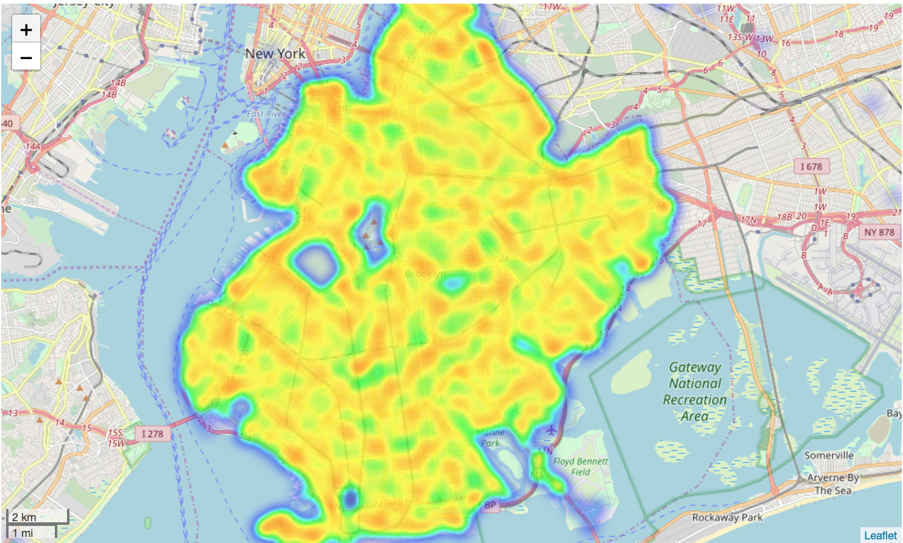

# nypd-mvc

## Introduction 
Analysis of New York Motor Vehicle Collisions, using data provided provided by the Police Department (NYPD) from 2012 to the present.

## Data
The source dataset can be viewed here: https://console.cloud.google.com/marketplace/details/city-of-new-york/nypd-mv-collisions https://opendata.cityofnewyork.us/Table 

ID:	bigquery-public-data:new_york_mv_collisions.nypd_mv_collisions 
Table Size:	358 MB 
Number of Rows: 1,481,712

## Guiding Question: 
How can we reduce the number of accidents in Brooklyn?

See the AnalysisDeck.pdf for the final submitted analysis, including maps, zipcode analysis, datetime analysis, and collision factor analysis. 

## Brooklyn accidents Folium heatmap

  

  

